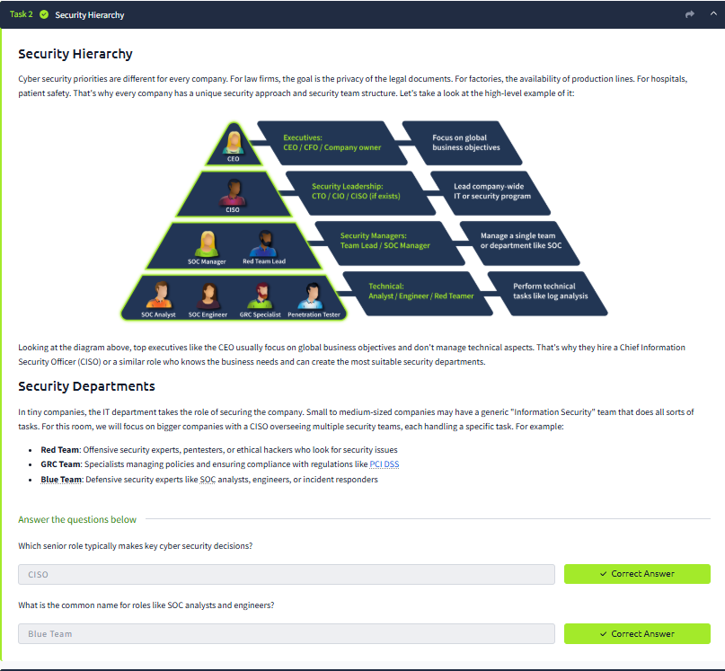
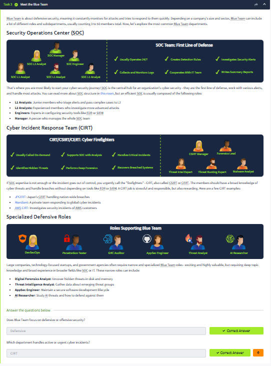
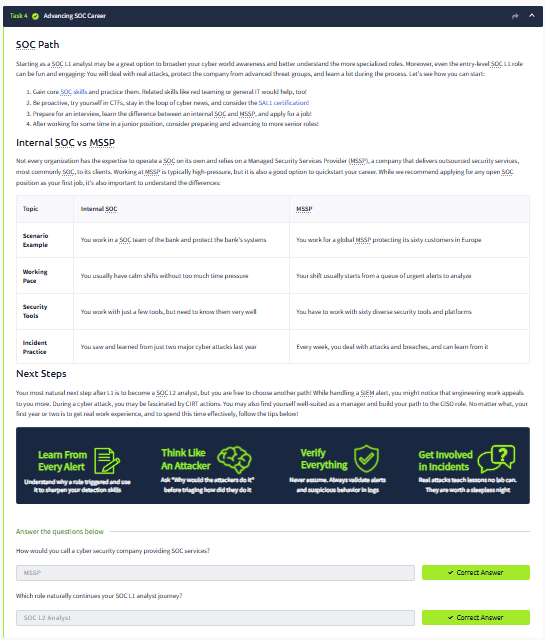
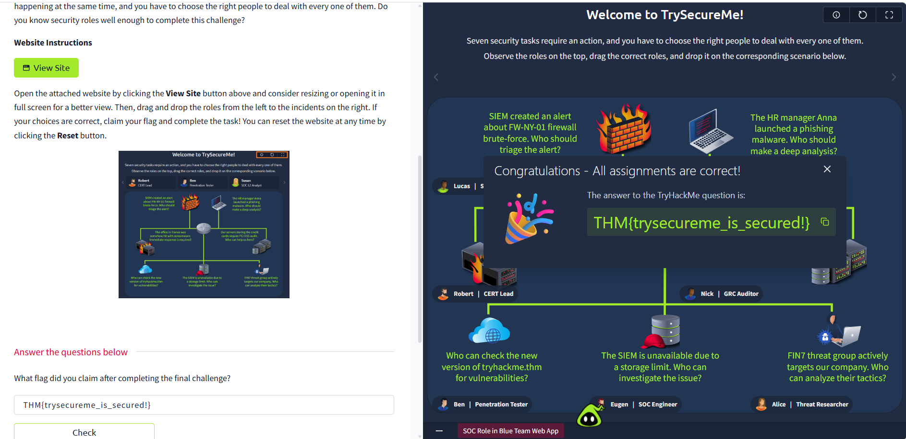

# 💎 SOC Role in Blue Team

## 📌 Project Description

The current project documents my completion of the TryHackMe "SOC Role in Blue Team" room.

This lab is focused on understanding the functions of a Security Operations Centre, the duties of SOC analysts, as well as how Blue Teams detect, investigate, and act on cybersecurity threats.

---

# 🎯 Lab Objectives

The objective of this lab was to:

- Identify the role of a Security Operations Centre (SOC)
- Understand the roles of a SOC analyst
- Understand Blue team security operations
- Identify security incident detection and response processes

# 🏢 What is a Security Operations Centre (SOC)?

A Security Operations Centre (SOC) is a team that monitors, analyzes, and takes action to resolve any potential security problems in an organization.

SOC teams leverage security solutions, methodologies, and threat intelligence to identify and mitigate cybersecurity risks.

---

# 👨‍💻 Role of a SOC Analyst

Within the current lab, I was able to learn about the main responsibilities of a SOC Analyst, which are:

- Monitoring security alerts
- Analysis of security events and logs
- Investigation of suspicious activity
- Identifying Indicators of Compromise (IoCs)
- Initial incident triage
- Escalation of security incidents when necessary
- Assistance with incident response operations

---

# 🔵 Blue Team Responsibilities

Blue Teams protect an organization's infrastructure from any cyberthreats.

Main responsibilities are:

- Security monitoring
- Detection of threats
- Investigation of incidents
- Response to incidents
- Vulnerability management
- Enhancing security controls

---

# 🔄 SOC Investigation Workflow

General workflow of SOC includes the following steps:

1. Gathering of security events from various sources
2. Monitoring security events using tools such as SIEM
3. Generation of alerts based on suspicious activity
4. Investigation and analysis of an alert by SOC analysts
5. Escalation and response of confirmed incidents

---

# 🛠️ Tools and Technologies

- TryHackMe Blue Team Lab Environment
- Security Information and Event Management (SIEM) fundamentals
- Security monitoring tools
- Log analysis approaches

---

# 📚 Skills Demonstrated

- Principles of SOC operation
- Fundamentals of Blue Team security
- Security monitoring principles
- Incident response procedures
- Threat detection
- Responsibilities of SOC analyst

---

# 🎯 Key Takeaways

As a result of the current lab, I have gained knowledge on:

- SOC team operations in real security environment
- Significance of monitoring and analyzing security events
- SOC analyst role in detection and prevention of threats
- Blue Team protection from cyberattacks

---

# 📸 Evidence

## Task Completion

